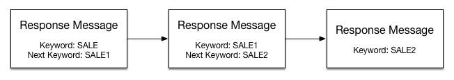
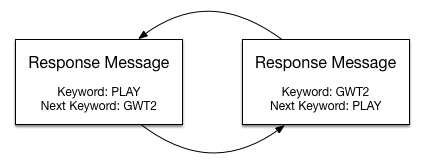

# Neural Network Application

## Overview

This application provides an API to enable Salesforce Marketing Cloud MobileConnect response message templates to interact with a neural network server that determines answers to famous characters.

It is intended as a proof-of-concept to demonstrate the scripting capabilities of AMPscript in conjunction with MobileConnect message templates. This application could be extended for the following use cases:

1. Other neural networking services (like IBM Watson)
2. Alternative to web-form responses
3. Solicit a set of personal information in mobile opt-in programs

## MobileConnect

Before learning about the SMS message workflow used by this application, it's important to understand how message chains work in MobileConnect.

With MobileConnect messages, a keyword can be assigned to response message templates. In turn, if an MO (Mobile Originated) user sends a keyword to a shortcode or longcode and that keyword is linked to a message template, the response message will be returned to the MO user.

For example, if a response message template has the keyword 'SALE' and an MO user texts 'SALE' to the linked shortcode/longcode, then the outbound response message in the template will be sent to the MO user.

### Verbs and Nouns

In MobileConnect 'verbs' refer to keywords used in templates and 'nouns' refer to MO replies (the strings preceeding the verb). For example if a user sends a message: 'SALE sam@sample.com' then 'sam@sample.com' is regarded as a noun.

### Message Chains

In addition to assigning keywords to message templates, you can also assign Next keywords to message templates. Thie enables two or more messages to be linked (or chained) together. When a user replies to a message with a noun and a next keyword is assigned to that template, then the message will be interpreted with the keyword. For example:

1. User sends message 'SALE' to shortcode or longcode.
2. Response message template has 'SALE1' set as Next keyword and sends outbound response message 'please send your email address'
3. User replies 'sam@sample.com'.
4. MO message is interpreted as 'SALE1 sam@sample.com' and is parsed by a message template.

This chain can continue for mulitple messages as indicated below. Once the user reaches the last template in the chain, they will be ejected from the chain.

### Message Loop

In the scenario of this application, there can be a large number of messages, so rather than creating a long message chain, we have configured two identical response message templates in a loop by referring each other (the same AMPscript is used in both message templates). This is illustrated below.

##AMPscript

The AMPscript functions used in the message template are explained in this section. The complete AMPscript file is available at [mobileconnect/outboundResponse.txt](mobileconnect/outboundResponse.txt).

### Define Variables

Firstly, the variables used within the AMPscript block are defined. 

	var @shortLongCode, @sessionDE, @questionLogDE, @answerLogDE, @apiEndpoint,
	    @sessionToken, @newSession, @sessionQuestion, @sessionAnswer, @sessionEnd, @startKeyword

### Declare Variables

Then the variables are declared.

	set @shortLongCode = "61409063302"
	set @sessionDE = "GW Active Sessions"
	set @questionLogDE = "GW Outbound Messages"
	set @answerLogDE = "GW Inbound Messages"
	set @apiEndpoint = "https://guesswho-api.d121.com"
	set @startKeyword = "PLAY"
	set @logging = false

Next we want to evaluate whether the MO (Mobile Originated) message is a new session. That is, the MO message is the keyword.

Normally, we would not need to do this as MobileConnect identifies the keyword and triggers the linked message template as explained above. However, in the scenario where a recipient is already in a message chain and wants to reply PLAY to "reset" the game (and start over) their keyword will be parsed as a noun.

There are three scenarios here:

1. The recipient starts an MO conversation with with keyword "PLAY" to message template 1, which sends the message "PLAY".
2. The recipient responds with keyword "PLAY" to message template 1, which sends the message "PLAY PLAY".
3. The recipient responds with keyword "PLAY" to message template 2, which sends the message "GWT2 PLAY" (where 'GWT2' is the keyword assigned to the second message).

The function `[MSG(0)]` below returns the complete message. This is used to check if the message is equal to the keyword, if this is a new cnversation, we need to retrieve a unique token from the remote API server and upsert the value along with the mobile number to a session Data Extension (using the `UpsertData()` function). This token is required for later use.

The function `[MSG(0).NOUNS]` below returns the noun, ignoring the prefixed verb and would be interpreted as 'PLAY'.

	if trim(uppercase([MSG(0)])) == @startKeyword
	or trim(uppercase([MSG(0).NOUNS])) == @startKeyword then
	   set @newSession = true 
	   UpsertData(@sessionDE, 1, "mobile", MOBILE_NUMBER, "token", HTTPGET(CONCAT(@apiEndpoint,"/newsession")), "created", SystemDateToLocalDate(Now()), "sessionEnded", 0)
	endif

The variable declared below retrieves the token that has been upserted to the session Data Extension.

	set @sessionToken = Lookup(@sessionDE, "token", "mobile", MOBILE_NUMBER)

Next we define the API routes to retrieve questions (using the `HTTPGET()` function). These routes differ depending on if the first question is asked, or another question (which includes the MO reply in the API route). 

	if @newSession == true then
	   set @sessionQuestion = HTTPGET(CONCAT(@apiEndpoint,"/game/", @sessionToken))
	else
	   set @sessionQuestion = HTTPGET(CONCAT(@apiEndpoint,"/game/", @sessionToken, "/response/", [MSG(0).NOUNS]))
	endif

Next, the two `InsertData` functions are optional, but if enabled will log the question and answers to Data Extensions. This is useful for debugging purposes, but disabled for perfomance considerations.

	if @logging == true then
	InsertData(@questionLogDE, "mobile", MOBILE_NUMBER, "token", @sessionToken, "message", @sessionQuestion, "created", SystemDateToLocalDate(Now()))
	endif

	if @newsession != true and @logging == true then
	   InsertData(@answerLogDE, "mobile", MOBILE_NUMBER, "token", @sessionToken, "message", [MSG(0).NOUNS], "created", SystemDateToLocalDate(Now()))
	endif

All answers returned from the server begin with the string `"I think of"`. This answer string is customised using a `substring()` function.

In addition, an `EndSmsConversation()` function ends the current conversation for MO user. **This is important,** as without including this function, the MO user would stay "trapped" in the message loop and will not be able to use any other keywords assigned to the shortcode or longcode (as they will be evaluated as a noun).

	if Substring(@sessionQuestion,1,10) == "I think of" then
	   set @sessionEnd = true
	   set @sessionAnswer = CONCAT("Your character must be: ",Substring(@sessionQuestion,12,100),".")
	   UpdateData(@sessionDE, 1, "mobile", MOBILE_NUMBER, "sessionEnded", 1)
	   EndSmsConversation(@shortLongCode,MOBILE_NUMBER)
	endif
	]%%

Finally, the inline AMPscript below returns conditional messages to the MO user, based on whether the first question, other questions, or the final answer is displayed.

Note that any line breaks used in this setction are preserved and will appear as line breaks in the MT message.

	%%[if @newSession == true then]%%
	Think of a real or fictional character.

	Reply to questions: "yes", "no", "don't know", "probably", or "probably not".
	%%[endif]%%
	%%[if @sessionEnd != true then]%%
	%%=v(@sessionQuestion)=%%
	%%[else]%%
	%%=v(@sessionAnswer)=%%

	Thanks for playing! Reply "play" to start a new game.
	%%[endif]%%

### Resources

For further information on AMPscript in Marketing Cloud, refer to [AMPscript documentation](http://help.exacttarget.com/en/documentation/exacttarget/content/ampscript/).

